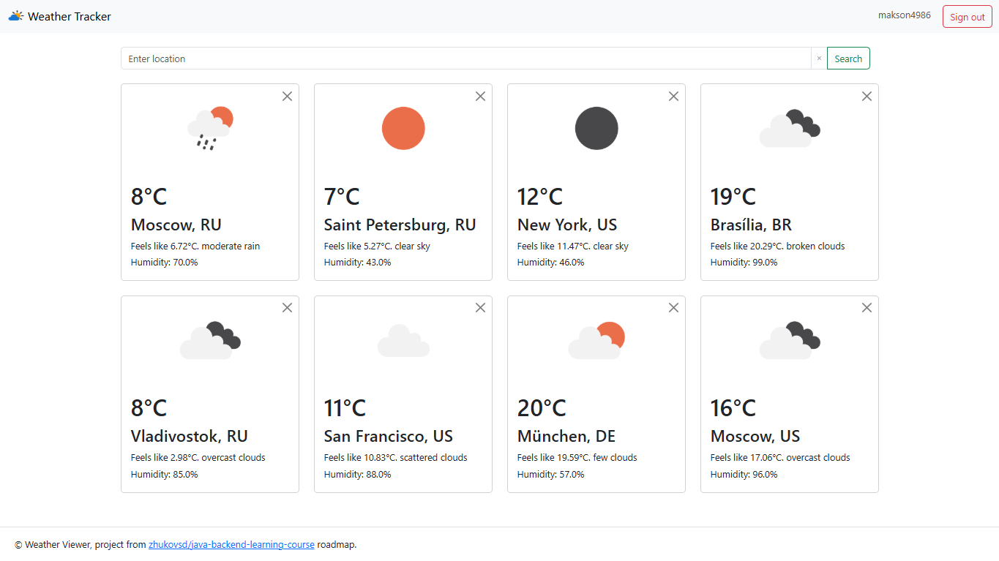

# Проект "Погода"
Веб-приложение для просмотра текущей погоды. 
Пользователь может зарегистрироваться и добавить в коллекцию одну или несколько локаций (городов, сёл, других пунктов), 
после чего главная страница приложения начинает отображать список локаций с их текущей погодой.

## Функционал приложения

**Работа с пользователями:**
* Регистрация
* Авторизация
* Logout

**Работа с локациями:**
* Поиск
* Добавление в список
* Просмотр списка локаций, для каждой локации отображается название и температура
* Удаление из списка

## Интерфейс приложения
Для вёрстки используется [Bootstrap 5.](https://cdn.jsdelivr.net/npm/bootstrap@5.3.0/dist/css/bootstrap.min.css)

### Главная страница
* Заголовок
  * Для неавторизованных пользователей - кнопки регистрации и авторизации
  * Для авторизованных пользователей - логин текущего пользователя и кнопка Logout
* Контент
  * Поле ввода для поиска локации по названию
  * Список добавленных локаций. Каждый элемент списка отображает название, текущую температуру и кнопку "удалить"

### Страница результатов поиска локаций по названию
Переход на эту страницу осуществляется в результате заполнения поля ввода на главной странице, либо на странице результатов поиска.

Содержимое:
* Заголовок, такой же как на главной странице
* Поле ввода для поиска по названию - такое же, как на главной странице, чтобы не возвращаться туда для каждого нового поиска
* Список найденных локаций с кнопкой “добавить”. При нажатии на кнопку происходит переход на главную страницу

### Остальное
* Страницы с формами регистрации и авторизации
